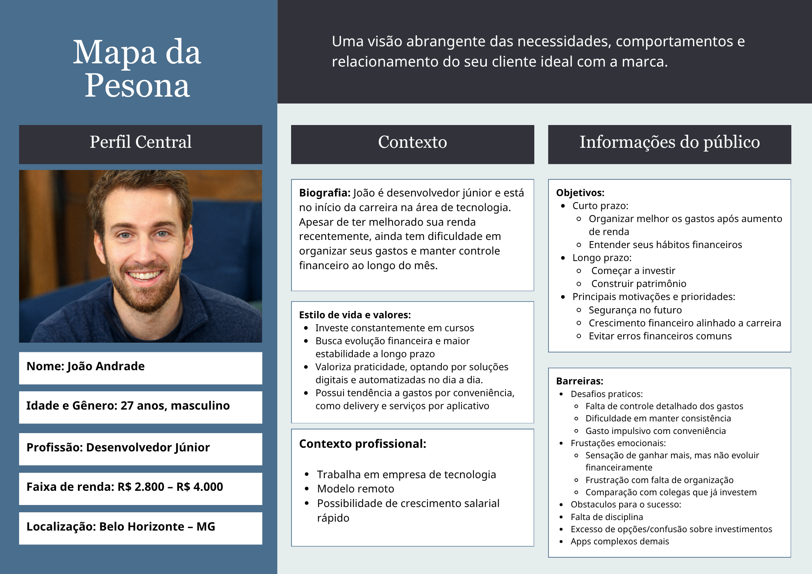
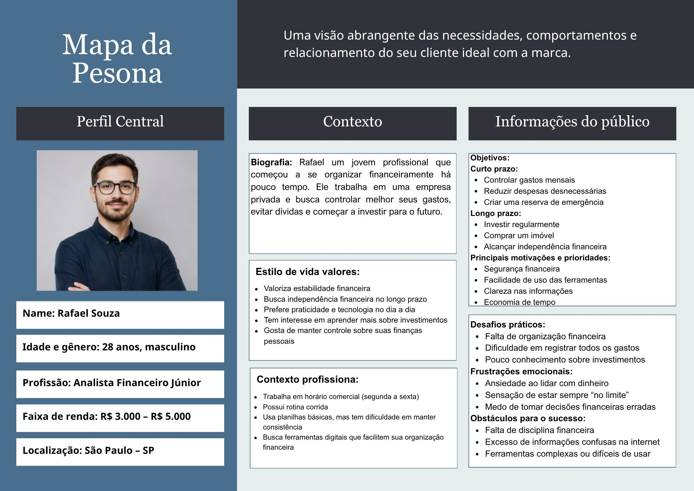
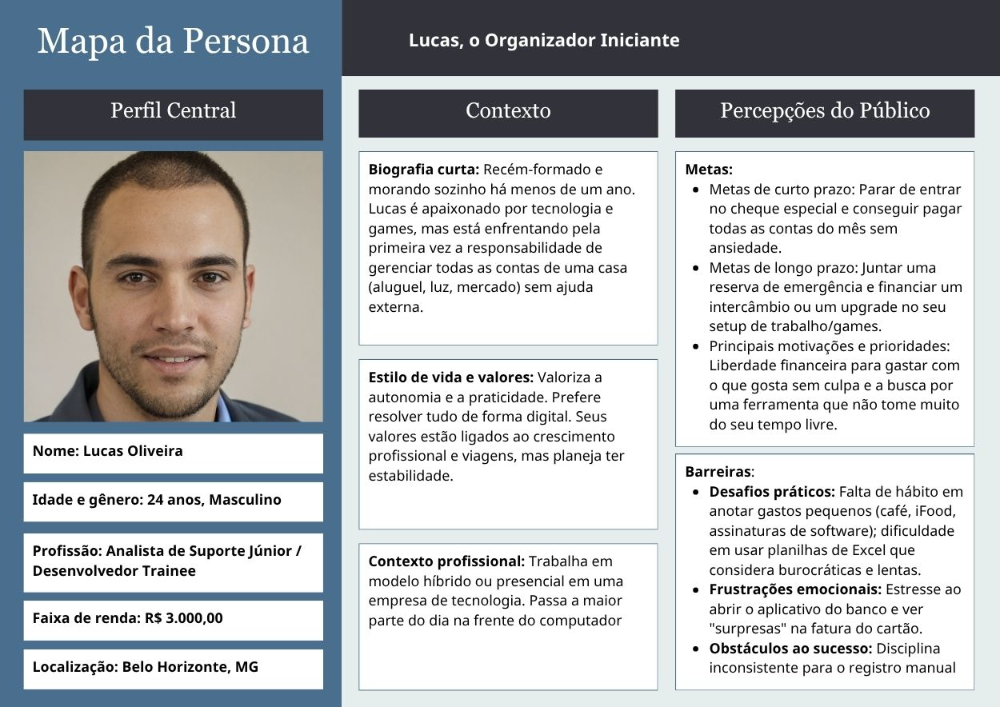
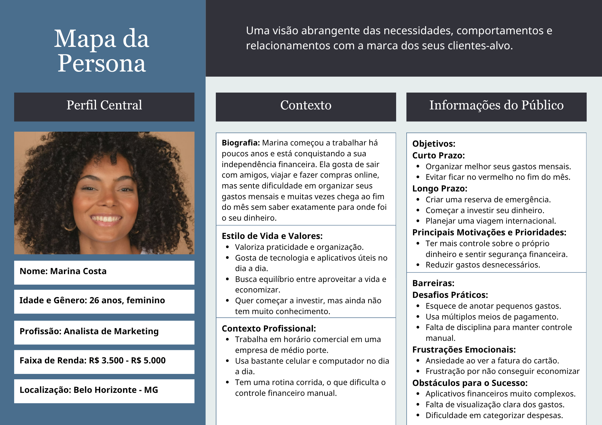
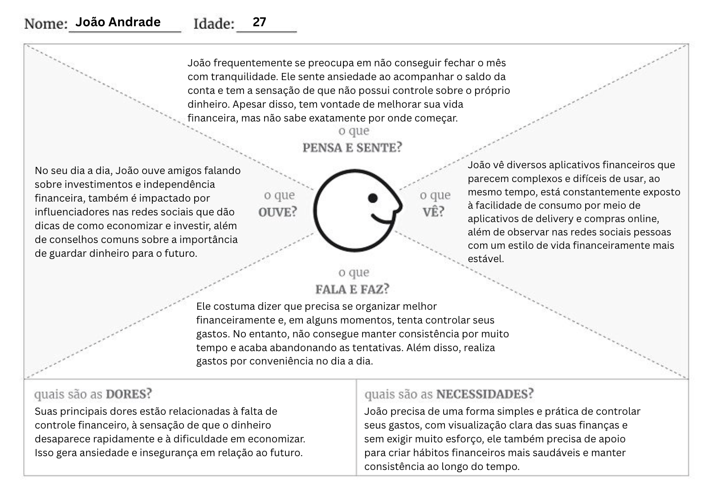
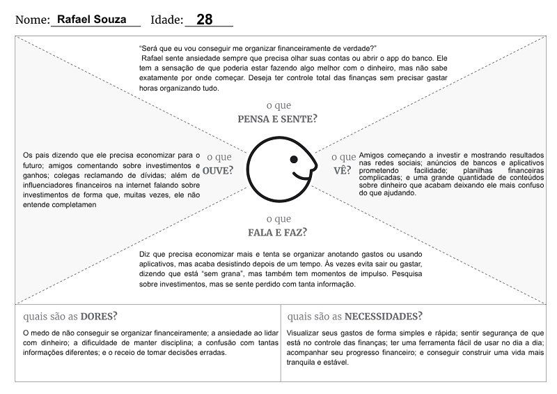
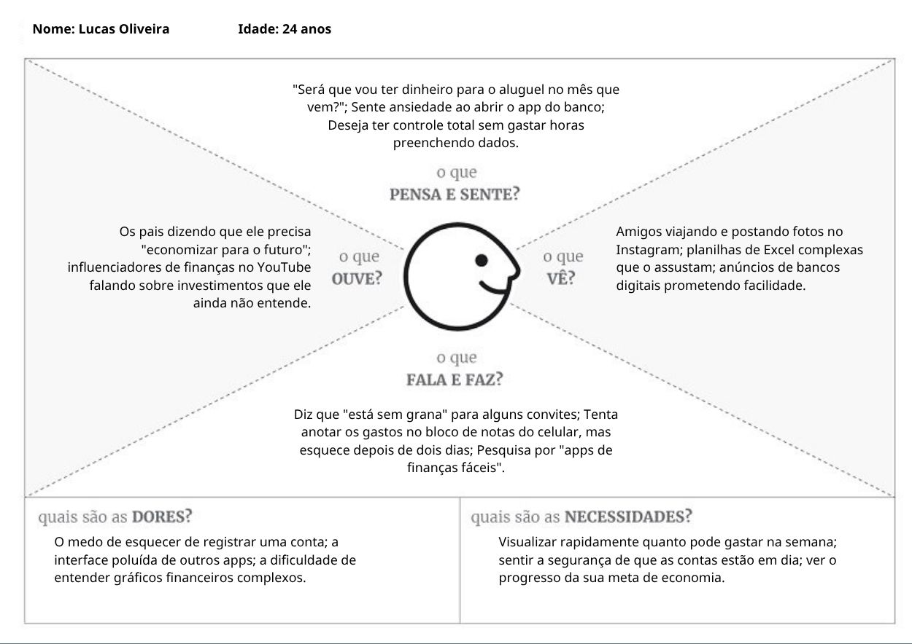
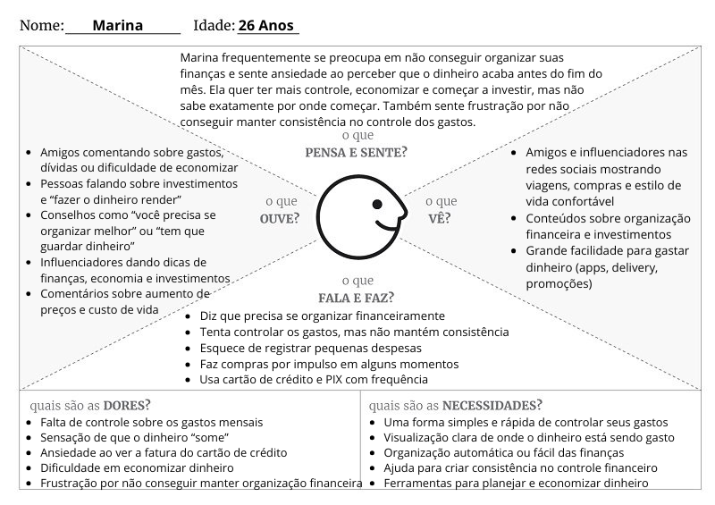

# 4. PROJETO DO DESIGN DE INTERAÇÃO

## 4.1 Personas
Nesta seção você deve detalhar as personas do seu projeto. Deve-se documentar uma persona por integrante do projeto. Para mais informações sobre personas consulte: https://www.rdstation.com/blog/marketing/persona-o-que-e/. Sugere-se a utilização de um template do Canva: https://www.canva.com/pt_br/modelos/s/persona/

## 4.2 Mapa de Empatia
Mapa da Empatia é um material utilizado para conhecer melhor o seu cliente. A partir do mapa da empatia é possível detalhar a personalidade do cliente e compreendê-la melhor. O objetivo é obter um nível mais profundo de compreensão de uma persona. A seguir um exemplo de template que pode ser usado para o mapa de empatia. Para cada persona deverá ser apresentado o seu respectivo mapa de empatia. Sugere-se a utilização do template apresentado em https://www.rdstation.com/blog/marketing/mapa-da-empatia/.

## 4.3 Protótipos das Interfaces
Apresente nesta seção os protótipos de alta fidelidade do sistema proposto. A fidelidade do protótipo refere-se ao nível de detalhes e funcionalidades incorporadas a ele. Assim, um protótipo de alta fidelidade é uma representação interativa do produto, baseada no computador ou em dispositivos móveis. Esse protótipo já apresenta maior semelhança com o design final em termos de detalhes e funcionalidades. No desenvolvimento dos protótipos, devem ser considerados os princípios gestálticos, as recomendações ergonômicas e as regras de design (como as 8 regras de ouro). É importante descrever no texto do relatório como os princípios gestálticos e as regras de ouro foram seguidas no projeto das interfaces. Nesta etapa deve-se dar uma ênfase na implementação do software de modo que possam ser realizados os testes com usuários na etapa seguinte.

---

### Tela de Login – Tio Patinhas

### Objetivo da Tela  
Permitir que o usuário acesse sua conta no sistema de controle financeiro por meio da inserção de suas credenciais (e-mail e chave mestra). A tela funciona como ponto de entrada seguro, garantindo que apenas usuários autenticados tenham acesso às funcionalidades do sistema.

### Princípios Gestálticos

- **Proximidade:** Os campos de entrada (e-mail e chave mestra) e o botão de ação estão agrupados em uma única área central, indicando claramente que fazem parte do mesmo fluxo de interação.

- **Semelhança:** Os campos de entrada compartilham o mesmo estilo visual (cores, bordas arredondadas e tipografia), reforçando a consistência e facilitando o reconhecimento dos elementos interativos.

- **Continuidade:** A organização vertical dos elementos conduz naturalmente o olhar do usuário do topo (identidade visual) até o botão principal de ação, favorecendo a navegação intuitiva.

- **Figura-fundo:** O contraste entre o fundo escuro do formulário e o fundo claro da página destaca a área de interação principal, direcionando a atenção do usuário.

- **Fechamento:** O contorno do card central cria uma unidade visual bem definida, permitindo que o usuário perceba o formulário como um bloco coeso e organizado.

### Regras de Ouro

- **Consistência:** A interface mantém padronização visual entre campos, botões e tipografia, criando uma experiência previsível e familiar.

- **Feedback:** O botão “Destravar Cofre” apresenta destaque visual (cor contrastante), indicando claramente sua função como ação principal.

- **Prevenção de erros:** O uso de campo específico para senha (chave mestra) com ocultação de caracteres contribui para a segurança e evita exposição acidental de dados sensíveis.

- **Reconhecimento em vez de memorização:** O uso de rótulos claros (“E-mail” e “Chave Mestra”) reduz a necessidade de o usuário lembrar informações adicionais.

- **Controle do usuário:** A presença de uma opção para novos usuários (“Forje seu cofre”) oferece liberdade de navegação e acesso a cadastro.

### Recomendações Ergonômicas

- **Clareza visual:** O alto contraste entre texto, campos e fundo melhora a legibilidade, especialmente em ambientes com diferentes condições de iluminação.

- **Hierarquia da informação:** A identidade visual no topo, seguida pelos campos e pelo botão de ação, estabelece uma hierarquia clara de uso.

- **Redução da carga cognitiva:** A interface apresenta apenas os elementos essenciais para login, evitando distrações e simplificando a tarefa.

- **Acessibilidade:** O tamanho dos campos e do botão facilita a interação, inclusive em dispositivos móveis.

- **Compatibilidade com o usuário:** A linguagem utilizada (“Destravar cofre” e “Chave mestra”) reforça a metáfora do sistema financeiro, tornando a experiência mais intuitiva e alinhada ao contexto do produto.

---

### Tela de Cadastro – Tio Patinhas

### Objetivo da Tela  
Permitir que novos usuários realizem o cadastro no sistema de controle financeiro por meio da inserção de seus dados (nome completo, e-mail e chave mestra), a tela funciona como porta de entrada para novos usuários, garantindo um processo simples, seguro e orientado.

### Princípios Gestálticos

- **Proximidade:** Os campos de entrada (nome completo, e-mail e chave mestra) e o botão de ação estão agrupados em uma única área central, indicando claramente que fazem parte do mesmo fluxo de cadastro.

- **Semelhança:** Os campos de entrada compartilham o mesmo estilo visual (cores, bordas arredondadas e tipografia), reforçando a consistência e facilitando o reconhecimento dos elementos interativos.

- **Continuidade:** A organização vertical dos elementos conduz naturalmente o olhar do usuário do topo (título e identidade visual) até o botão principal de ação, favorecendo a navegação intuitiva.

- **Figura-fundo:** O contraste entre o fundo escuro do formulário e o fundo claro da página destaca a área de interação principal, direcionando a atenção do usuário.

- **Fechamento:** O contorno do card central cria uma unidade visual bem definida, permitindo que o usuário perceba o formulário como um bloco coeso e organizado.

### Regras de Ouro

- **Consistência:** A interface mantém padronização visual entre campos, botões e tipografia, criando uma experiência previsível e familiar, alinhada à tela de login.

- **Feedback:** O botão “Criar Meu Cofre” apresenta destaque visual (cor contrastante), indicando claramente sua função como ação principal.

- **Prevenção de erros:** O uso de campo específico para senha (chave mestra) com ocultação de caracteres contribui para a segurança e evita exposição acidental de dados sensíveis.

- **Reconhecimento em vez de memorização:** O uso de rótulos claros (“Nome Completo”, “E-mail” e “Chave Mestra”) reduz a necessidade de o usuário lembrar informações adicionais.

- **Controle do usuário:** A presença de uma opção para usuários já cadastrados (“Acesse aqui”) oferece liberdade de navegação e retorno à tela de login.

### Recomendações Ergonômicas

- **Clareza visual:** O alto contraste entre texto, campos e fundo melhora a legibilidade, especialmente em ambientes com diferentes condições de iluminação.

- **Hierarquia da informação:** O título e subtítulo no topo, seguidos pelos campos e pelo botão de ação, estabelecem uma hierarquia clara de uso.

- **Redução da carga cognitiva:** A interface apresenta apenas os elementos essenciais para cadastro, evitando distrações e simplificando a tarefa.

- **Acessibilidade:** O tamanho dos campos e do botão facilita a interação, inclusive em dispositivos móveis.

- **Compatibilidade com o usuário:** A linguagem utilizada (“Criar cofre” e “Chave mestra”) reforça a metáfora do sistema financeiro, tornando a experiência mais intuitiva e alinhada ao contexto do produto.

### Tela do Painel de Controle

### Objetivo da Tela  
Apresentar ao usuário uma visão geral do seu patrimônio financeiro, reunindo informações consolidadas como saldo total, receitas, despesas, investimentos e evolução ao longo do tempo. A tela funciona como painel principal do sistema, permitindo monitoramento rápido e apoio à tomada de decisões.

### Princípios Gestálticos

- **Proximidade:** Os indicadores financeiros estão organizados em blocos (cards) agrupados por contexto, facilitando a compreensão das informações relacionadas.

- **Semelhança:** Os cards seguem um padrão visual consistente (cores, tipografia e estrutura), reforçando a unidade e facilitando a leitura dos dados.

- **Continuidade:** A disposição dos elementos conduz o olhar da esquerda para a direita e de cima para baixo (menu lateral → resumo → gráficos → metas), criando um fluxo natural de navegação.

- **Figura-fundo:** O contraste entre o fundo claro da interface e os cards destacados direciona a atenção do usuário para as informações principais.

- **Fechamento:** Cada seção (resumo, gráfico, categorias e metas) é delimitada visualmente em containers, permitindo que o usuário perceba claramente os blocos de informação.

### Regras de Ouro

- **Consistência:** A interface mantém padronização visual entre cards, botões, gráficos e menu lateral, criando uma experiência uniforme em todo o sistema.

- **Feedback:** Elementos interativos como o botão “+ Nova Transação” possuem destaque visual, indicando claramente sua função e incentivando a ação.

- **Prevenção de erros:** A organização clara das informações evita interpretações equivocadas, reduzindo o risco de decisões baseadas em dados confusos.

- **Reconhecimento em vez de memorização:** Informações importantes são exibidas diretamente na tela (saldo, receitas, despesas, categorias), eliminando a necessidade de o usuário lembrar dados.

- **Controle do usuário:** O menu lateral permite acesso rápido às principais funcionalidades (Dashboard, Transações, Investimentos, Metas), garantindo liberdade de navegação.

### Recomendações Ergonômicas

- **Clareza visual / Legibilidade:** O uso de cores contrastantes, tipografia adequada e espaçamento entre elementos facilita a leitura e interpretação rápida das informações.

- **Hierarquia da informação:** Os dados mais importantes (saldo total e indicadores principais) estão em destaque no topo, seguidos por gráficos e informações complementares.

- **Minimização da carga de trabalho do usuário:** As informações são apresentadas de forma resumida e organizada, permitindo que o usuário compreenda sua situação financeira sem esforço excessivo.

- **Redução da carga cognitiva:** A divisão das informações em cards e gráficos evita sobrecarga visual e facilita o processamento das informações.

- **Acessibilidade:** Elementos bem espaçados, botões visíveis e gráficos claros facilitam a interação em diferentes dispositivos.

- **Compatibilidade com o usuário:** A linguagem utilizada (“Patrimônio”, “Receitas”, “Despesas”, “Metas”) está alinhada ao contexto financeiro, tornando a interface intuitiva e de fácil entendimento.

### Tela de Transações

---

### Telade Investimentos

---

### Tela de Metas

---

### Tela de Perfil e Segurança

## 4.4 Testes com Protótipos
Nesta seção você deve apresentar os testes realizados com usuários utilizando os protótipos de alta fidelidade desenvolvidos na seção anterior. O objetivo é avaliar a usabilidade, a clareza das informações e a adequação do design às necessidades das personas definidas no projeto.

Cada integrante do grupo deverá aplicar o teste com um usuário distinto, preferencialmente alinhado ao perfil das personas criadas. Devem ser definidas previamente as tarefas que o usuário deverá executar no protótipo (por exemplo: realizar um cadastro, buscar um produto, concluir uma compra).

Durante a aplicação do teste, registre observações sobre comportamentos, dúvidas, erros e comentários feitos pelo usuário, bem como o tempo necessário para a execução de cada tarefa. Ao final, colete o feedback do participante, destacando pontos positivos e aspectos a serem melhorados.

Os resultados obtidos por todos os integrantes devem ser consolidados, apresentando uma análise geral com os principais problemas encontrados, oportunidades de melhoria e as ações previstas para o projeto final. 
